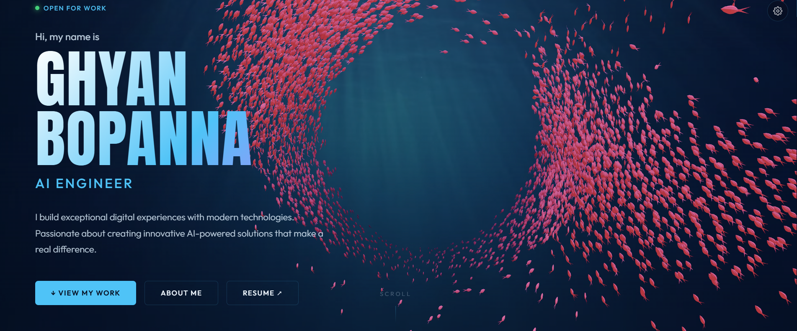

# 🌊 Deep Sea Boid Portfolio

* **Bioluminescent Boids:** An interactive flocking simulation set in the abyssal zone.
* **Interactive Navigation:** Fish react dynamically to user clicks, cursor lights, and project nodes.
* **Deep Sea Theme:** Sleek glassmorphic interfaces mimicking deep-sea exploration submersibles.
* **Tech Stack:** Engineered with vanilla HTML5 Canvas, modern CSS, and high-performance algorithms.
